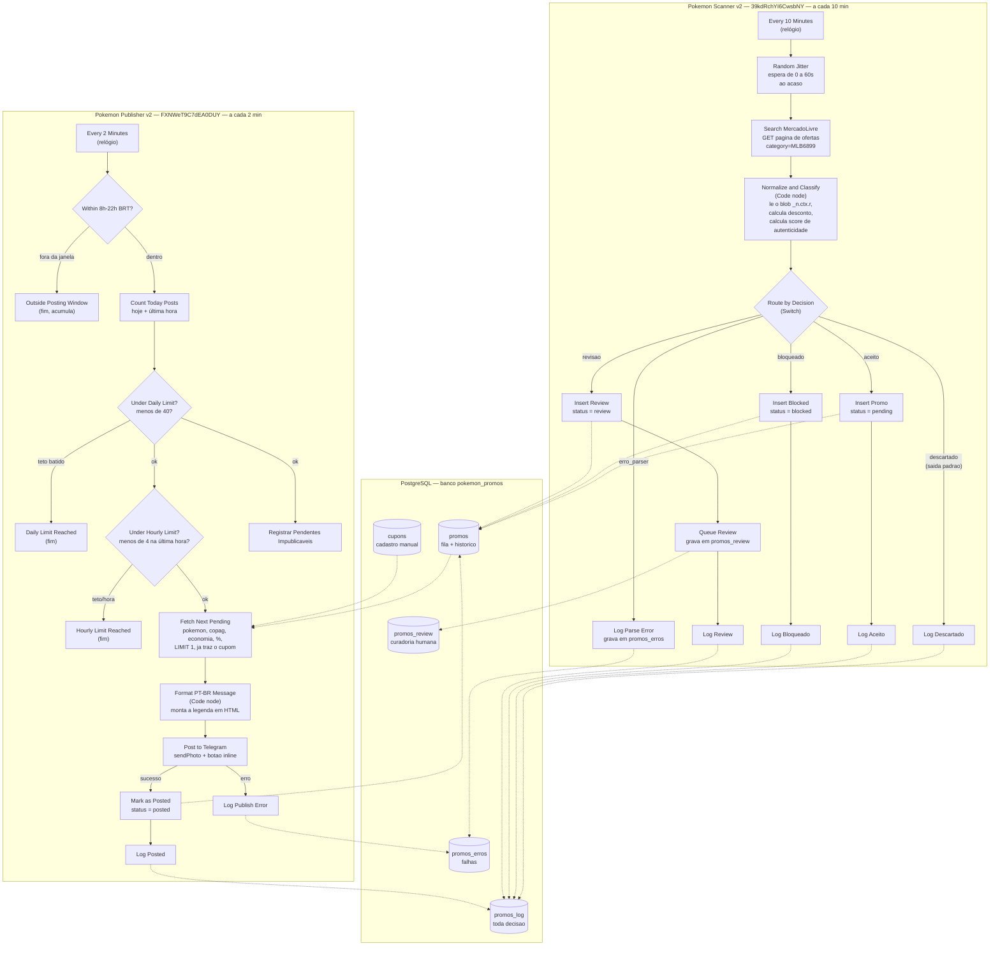
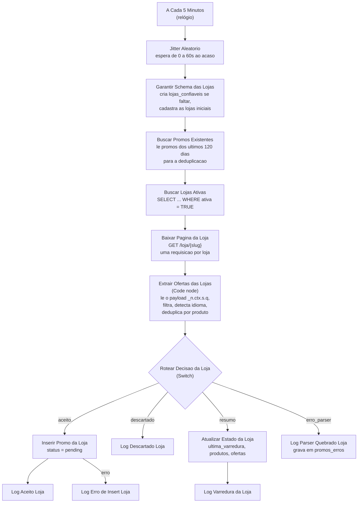

# Arquitetura

Este documento explica **como as peças do bot se encaixam**. Se você entender só um
arquivo desta pasta, entenda este. Valores de relógio e teto vigentes: Store Scanner
**5 min**, Publisher **2 min**, teto **40** — ver [regras-de-negocio.md](regras-de-negocio.md).

---

## 1. Visão geral em uma frase

O `Pokemon Store Scanner` lê a **vitrine** das lojas oficiais cadastradas e **enche uma
fila** no banco; o `Pokemon Publisher v2` **esvazia essa fila**, um item de cada vez,
publicando no Telegram. Os dois nunca conversam direto — o banco é o único ponto de contato.

(O `Pokemon Scanner v2`, que lia `ofertas?category=MLB6899`, está **desativado**. O diagrama
da seção 4 ainda o mostra porque o código existe e o Publisher é o mesmo.)

---

## 2. As peças

### Infraestrutura

| Peça | O que é | Detalhe |
| --- | --- | --- |
| **VPS Hostinger** | O servidor onde tudo roda | `srv1897392.hstgr.cloud` (identificador interno da máquina: `1897392`) |
| **n8n** | A plataforma de automação. Roda em Docker | Painel em <https://srv1897392.hstgr.cloud> |
| **PostgreSQL 16** | O banco de dados. Roda em Docker, container `pokemon-postgres` | Banco `pokemon_promos`, usuário `pokemon_bot` |
| **Rede Docker `n8n_default`** | A rede virtual que permite o n8n conversar com o banco | Os dois containers precisam estar nela. Fonte de um problema real; veja [troubleshooting](troubleshooting.md#p5--credencial-do-banco-para-de-conectar-couldnt-connect-with-these-settings) |
| **Bot do Telegram** | Publica no canal, como administrador | Canal `@promopokemontcg` ("Pokémon TCG Promo", id `-1004430553765`) |

O container do banco está configurado assim: imagem `postgres:16-alpine`, volume
`postgres_data` para os dados não se perderem em reinício, e a porta 5432 publicada
somente em `127.0.0.1` — ou seja, **o banco não é acessível da internet**, só de dentro
da própria VPS.

### Credenciais (nomes e IDs, nunca valores)

| Credencial no n8n | ID | Usada por |
| --- | --- | --- |
| Pokemon Promos DB (PostgreSQL) | `6jdqiaTfNIJseSqb` | Todos os nodes de banco dos 3 workflows |
| Pokemon Telegram Bot (Telegram API) | `jhasZWps6SfFVWaF` | O node `Post to Telegram` do Publisher |

### Fonte de dados

**Ativa hoje:** vitrine de cada loja em `https://www.mercadolivre.com.br/loja/{slug}`
(ex.: `/loja/pokemon`). Scraping do payload `_n.ctx.s.q`. Uma requisição por loja, sem
paginação. Cabeçalhos de navegador (Chrome, `Accept-Language: pt-BR`).

**Desativada:** `https://www.mercadolivre.com.br/ofertas?category=MLB6899` (`MLB6899` =
Cartas Colecionáveis T.C.G). É o que o Scanner v2 lia (~9 produtos por página). A API
oficial está fechada — [Decisão 1](historico-de-decisoes.md#decisão-1--a-api-oficial-do-mercado-livre-está-descartada).

---

## 3. Por que dois workflows separados

Poderia ser um só workflow fazendo tudo. Foram separados de propósito, por quatro motivos:

1. **Ritmos diferentes.** Faz sentido varrer o Mercado Livre de tempo em tempo (as
   ofertas não mudam a cada minuto), mas publicar precisa ser espaçado para não afogar o
   canal. Com workflows separados, cada um tem seu próprio relógio.
2. **Falha isolada.** Se o Mercado Livre mudar a página e o Scanner quebrar, o Publisher
   continua publicando o que já está na fila. E se o Telegram estiver fora do ar, o
   Scanner continua enchendo a fila. Um problema não derruba o outro.
3. **Diagnóstico mais fácil.** Quando algo dá errado, você já sabe onde olhar: "não está
   entrando nada no banco" é problema do Scanner; "tem item na fila mas não sai post" é
   problema do Publisher.
4. **Ritmo de publicação controlado.** O Publisher publica **exatamente 1 item por
   execução**. Isso dá controle fino: mudar o intervalo do relógio muda o ritmo do canal,
   sem tocar em nenhuma lógica.

O preço dessa escolha é que o estado precisa viver fora dos workflows — e é exatamente
para isso que existe a tabela `promos`, que funciona como fila.

---

## 4. Diagrama do fluxo



> O diagrama acima mostra o `Pokemon Scanner v2`, que hoje está **desativado** (a página geral
> de ofertas saiu de escopo). Quem enche a fila agora é o `Pokemon Store Scanner`, descrito na
> seção 4b. O Publisher é o mesmo para os dois: ele lê a fila e não pergunta de onde o item
> veio.

---

## 4b. O `Pokemon Store Scanner` — o scanner ativo

`PNwaF3BYhj5KA8eY`, ativo, dispara a cada **5 minutos**. Ele varre as **lojas oficiais**
cadastradas em `lojas_confiaveis` e é hoje a única fonte que abastece o canal.

A diferença conceitual para o scanner antigo é a **procedência**. O Scanner v2 lia a página
geral de ofertas, cheia de réplica, e precisava de um filtro heurístico para adivinhar o que
era autêntico. O Store Scanner entra pela porta da frente da loja oficial da marca: se o
produto está lá, é original. A origem substitui a heurística.



### O formato dos dados é diferente

A página de loja **não** usa o mesmo formato da página de ofertas. Ela guarda o catálogo em
`_n.ctx.s.q("...")`, uma string JSON escapada que, depois de desescapada, **não é JSON
válido**: tem `u` solto no lugar de `undefined` e referências internas como `@335`. O Code
node reconstrói o JSON antes de interpretá-lo. É frágil por natureza — é formato interno do
front-end do Mercado Livre, que pode mudar sem aviso — e por isso a detecção de quebra é
levada a sério.

**Não há paginação:** uma requisição por loja devolve a vitrine inteira. Já foram testados e
descartados `?discount=`, `/ofertas`, `?page=` e `?offset=`; o Mercado Livre ignora todos em
silêncio.

### O que o Code node decide, na ordem

1. **Filtro de título** da loja (coluna `filtro_titulo`). É o que impede baralho de Truco da
   COPAG **e boneco Funko da loja oficial** de virarem post de Pokémon TCG. Desde 13/08/2026
   as duas lojas usam a mesma regex, que exige vocabulário de TCG e barra produto licenciado
   ([Regra 0b](regras-de-negocio.md#regra-0b--só-produto-de-tcg-não-qualquer-produto-pokémon)).
   O teste roda no título original **e** no normalizado, e uma regex inválida aborta a
   varredura daquela loja de propósito.
2. **É oferta de verdade?** Sem preço "de/por", o produto não entra. Preço cheio não é
   promoção.
3. **Desconto mínimo** da loja, mais os limites de preço. Descontos de 95% ou mais são
   tratados como erro de leitura, não como oportunidade.
4. **Idioma** da carta, pelas mesmas regras do Publisher.
5. **Deduplicação por produto** (a seção seguinte).

Reputação de vendedor praticamente não existe nesses cards (apareceu em 1 de 106 no
levantamento). O scanner grava `NULL` em vez de inventar um valor.

### A deduplicação de dois níveis

O primeiro nível é o `ON CONFLICT (item_id)` no `Inserir Promo da Loja`. Inserção nova
grava `pending`. Se o `item_id` já existe, o padrão continua sendo **não fazer nada** —
exceto quando o item já foi `posted` e o preço da vitrine caiu o bastante
([Decisão 33](historico-de-decisoes.md#decisão-33--repostar-se-o-preço-da-vitrine-cair-depois-do-post)):
aí vira `UPDATE` para `pending`, para o Publisher postar de novo. O scanner antigo e os
`INSERT` de blocked/review seguem `DO NOTHING`.

O problema é que uma loja pode anunciar **o mesmo produto em fichas diferentes**, com
`item_id` diferentes. Foi o que aconteceu no primeiro dia: o box Mega Zygarde ex apareceu
duas vezes, uma na página de catálogo (`/p/MLB69755805`) e outra na página de produto
(`/up/MLBU3914159030`), mesmo preço, e as duas entraram na fila. Publicar o mesmo box duas
vezes queima a credibilidade do canal.

Por isso existe um segundo nível, dentro do scanner, aplicado **antes** do `INSERT`:

| Critério | Quando vale | Por quê |
| --- | --- | --- |
| `product_id` de catálogo | Quando os dois anúncios têm | É identificação exata, sem ambiguidade |
| Título normalizado + preço | Quando não há `product_id` | Dois anúncios do mesmo produto tendem a ter as mesmas palavras e o mesmo preço |

O **título normalizado** é o título sem acento, sem pontuação, tudo em minúscula, sem palavras
genéricas (`pokemon`, `tcg`, `original`, `lacrada`, `colecao`, preposições) e com as palavras
restantes ordenadas em ordem alfabética, sem repetição. Assim "Pokémon Coleção Mega Zygarde ex
Box Lacrada Original Copag" e "Pokémon Tcg - Box Mega Zygarde Ex Box Mega Zygarde Ex Português"
viram a mesma assinatura: `box ex mega zygarde`.

Quando dois itens colidem, **fica o que tem `product_id` de catálogo**, porque o link de
catálogo é mais estável. O descartado vira uma linha em `promos_log` com o motivo por extenso,
incluindo qual item foi mantido e qual critério pegou — dá para auditar depois.

A comparação vale nas duas direções: **dentro da mesma varredura** e **contra o que já está em
`promos`** (o node `Buscar Promos Existentes` carrega os últimos 120 dias). Sem a segunda,
bastaria a varredura seguinte para o duplicado voltar.

E vale **entre lojas diferentes**, não só dentro de cada loja. Isso passou a importar quando a
COPAG entrou no escopo: o mesmo box pode estar anunciado na loja oficial e na COPAG, com
`item_id` diferente, e sem a comparação cruzada o canal publicaria o mesmo produto duas vezes
com dois links. Como a loja oficial tem prioridade menor na tabela, ela é varrida primeiro e
tende a ser a que fica — mas o critério do `product_id` de catálogo vem antes da ordem das
lojas.

### Quando o scanner grita

Como ele é a única fonte ativa, três situações viram registro em `promos_erros` **e** em
`lojas_confiaveis.ultimo_erro`:

- **HTTP diferente de 200** — bloqueio do Mercado Livre, loja fora do ar ou slug inválido.
- **Payload `_n.ctx.s.q` ausente ou indecifrável** — slug errado, loja removida, ou o layout
  do Mercado Livre mudou. Slug digitado errado produz exatamente esse sintoma: página 200 sem
  catálogo.
- **Vitrine válida com zero produtos** — o caso mais silencioso e mais perigoso, porque a
  página responde normalmente e simplesmente não há o que publicar.

Zero **ofertas** não é erro: significa que a loja está com preço cheio hoje. Zero **produtos**
é erro.

A cada execução o scanner atualiza `ultima_varredura`, `produtos_ultima` e `ofertas_ultima` na
linha da loja. São esses três números que dizem se a varredura está viva.

---

## 5. O caminho completo de um produto

Vamos seguir um produto real, do momento em que ele aparece na página de ofertas até o
post no canal. Este é o exemplo que de fato aconteceu no teste de ponta a ponta.

### Passo 1 — O relógio dispara (`Every 10 Minutes`)

O n8n acorda o Scanner. Nada mais acontece aqui: é só o gatilho.

### Passo 1b — Espera aleatória (`Random Jitter`)

Antes de tocar no Mercado Livre, o workflow para por um tempo sorteado entre 0 e 60
segundos. A conta é `Math.floor(Math.random() * 61)`, no campo **Amount** de um node do
tipo *Wait*.

O motivo é disfarce: um acesso que chega exatamente às 10h00, 10h10, 10h20, com precisão
de relógio, é fácil de reconhecer como robô. Com a espera aleatória, os horários ficam
irregulares e o tráfego se parece mais com gente navegando. O efeito colateral é que cada
execução do Scanner demora até um minuto a mais do que antes — é normal, não é travamento.

### Passo 2 — Buscar a página (`Search MercadoLivre`)

Um `GET` simples em `https://www.mercadolivre.com.br/ofertas?category=MLB6899`, com
cabeçalhos de navegador. Volta o HTML inteiro da página (algumas centenas de milhares de
caracteres) como texto.

Três ajustes importantes nesse node:

- `neverError: true` — se o Mercado Livre responder com erro, o node **não** derruba o
  workflow; passa a resposta adiante para o parser decidir o que fazer. É isso que
  permite detectar anti-bot em vez de simplesmente falhar.
- `timeout: 30000` — desiste depois de 30 segundos.
- `responseFormat: text` — não tenta interpretar como JSON.

### Passo 3 — Ler e classificar (`Normalize and Classify`)

Este Code node é o cérebro do bot. Ele faz cinco coisas em sequência:

**3.1. Encontra os produtos dentro do HTML.** A página de ofertas não traz os produtos em
tags HTML comuns; ela guarda tudo num bloco de JSON gigante que começa com `_n.ctx.r=`,
dentro de uma tag `<script id="__NORDIC_RENDERING_CTX__">`. Os produtos ficam ali em
"cards" de um formato interno do Mercado Livre chamado **polycard**.

O código acha esse bloco contando chaves `{` e `}` (respeitando textos entre aspas e
escapes, para não se confundir), converte para objeto e procura recursivamente o array de
cards. Essa é a **Estratégia 0 (Nordic)**, a prioritária.

Existem ainda cinco estratégias antigas de reserva (`__PRELOADED_STATE__`, `ld+json`,
script com `results`, cards HTML da página de busca, e resposta que já venha em JSON).
Elas só rodam se a Nordic não achar nada, e são herança da época em que a fonte era a
página de busca. Hoje nenhuma delas encontra nada nessa página — ficaram como rede de
segurança.

**3.2. Extrai os dados de cada card.** Título, preço atual, preço anterior (que vem numa
estrutura chamada `price_labels`), URL do produto e ID da imagem, que é remontado no
endereço do CDN (`https://http2.mlstatic.com/D_NQ_NP_{id}-O.webp`).

**3.3. Extrai a reputação do vendedor de um jeito torto, porque não tem escolha.** A
página de ofertas **não traz a reputação estruturada** como a API antiga trazia. O que
existe é um componente chamado `review_compacted` com a nota e o volume de vendas **em
texto**, tipo `"4.8"` e `"| +1000 vendidos"`. O código procura a nota por três padrões
diferentes, em ordem de confiança, e o volume pelo padrão `+N vendidos`, entendendo
`mil` e `mi` como multiplicadores.

Se o componente não existir, ele usa o **padrão neutro: nota 3.0 e 0 vendas**. Esse valor
é combinado e importa em dois outros lugares: o filtro de autenticidade penaliza vendedor
sem reputação publicada, e o Publisher **esconde a linha do vendedor** no post quando vê
exatamente `3.0 / 0 vendas`, porque mostrar "nota 3.0, 0 vendas" passaria desconfiança.

**3.4. Calcula o desconto e converte para centavos.** `discount_pct` sai de
`(preço original − preço atual) / preço original × 100`. Preços viram inteiros em
centavos com `Math.round(preço × 100)`.

**3.5. Decide o destino do produto.** Aqui entram as regras de negócio, na ordem exata em
que estão no código:

1. Desconto **acima de 60%** → `bloqueado` (suspeita de golpe)
2. Score de autenticidade **≤ −40** → `bloqueado` (suspeita de falsificação)
3. Desconto **abaixo de 15%** → `descartado` (não agrega valor ao canal)
4. Score de autenticidade **≥ +25** → `aceito`
5. Qualquer outro caso (score entre −40 e +25) → `revisao`

A ordem importa: um produto com 70% de desconto é bloqueado como golpe antes de a
autenticidade ser sequer avaliada. Todos os detalhes de cada regra estão em
[regras-de-negocio.md](regras-de-negocio.md).

O node também monta o **link de afiliado** aqui, na função `montarLinkAfiliado`: pega o
`permalink`, joga fora qualquer `?parâmetro` que já venha nele e cola
`?matt_word=caed1312314&matt_tool=96097202&forceInApp=true`. O detalhamento de cada
parâmetro está em [regras-de-negocio, seção 10](regras-de-negocio.md#10-link-de-afiliado).

E escapa aspas simples em todo texto (`'` vira `''`), porque os textos vão ser colados
dentro de comandos SQL montados à mão. Sem isso, um título com apóstrofo quebraria a
gravação no banco.

### Passo 4 — Rotear (`Route by Decision`)

Um node do tipo **Switch**, que é um "vai por aqui ou por ali" com várias saídas. Ele lê
o campo `decision` e manda o item para uma das cinco saídas:

| Saída | `decision` | Vai para |
| --- | --- | --- |
| 0 | `aceito` | `Insert Promo` |
| 1 | `bloqueado` | `Insert Blocked` |
| 2 | `erro_parser` | `Log Parse Error` |
| 3 | `revisao` | `Insert Review` |
| 4 (padrão) | qualquer outra coisa, na prática `descartado` | `Log Descartado` |

> Este Switch já foi origem de um bug grave: em uma versão anterior, os três destinos
> estavam todos ligados na **mesma saída**, e cada produto era gravado como aceito,
> bloqueado e descartado ao mesmo tempo. Se você mexer nas saídas, confira uma por uma.

### Passo 5 — Gravar no banco

Os três caminhos que gravam produto (`Insert Promo`, `Insert Blocked`, `Insert Review`)
usam o mesmo `INSERT` com `ON CONFLICT (item_id) DO NOTHING`, que é a forma de dizer
"se esse produto já está no banco, não faça nada". É assim que a **deduplicação**
funciona, sem precisar consultar antes.

Cada caminho grava também uma linha em `promos_log`, com a decisão e o motivo. Os nodes de
log são espertos o suficiente para distinguir `aceito` de `duplicado`: o `INSERT` devolve
o `item_id` quando gravou de verdade e nada quando o produto já existia, então o log usa
isso para saber qual dos dois aconteceu.

Um detalhe fácil de errar e que já foi errado: os logs precisam ler os dados do node
`Normalize and Classify` (`$("Normalize and Classify").item.json`), e não do `INSERT`
anterior, porque depois do `INSERT` os campos originais já não existem mais.

### Passo 6 — O relógio do Publisher dispara e quatro portas se abrem

A cada **2 minutos** o Publisher acorda e passa por **quatro** portões, em ordem:

1. **`Within 8h-22h BRT?`** — está entre 8h e 22h no horário de Brasília? A conta usa
   `$now.setZone("America/Sao_Paulo").hour`, com as condições "≥ 8" e "< 22". Fora da
   janela, o fluxo termina em `Outside Posting Window` e nada se perde: a fila continua
   parada, esperando o dia seguinte.
2. **`Count Today Posts`** → **`Under Daily Limit?`** — conta quantos posts já saíram hoje
   (`status = 'posted'` com `posted_at` de hoje) e segue só se for menos de **40**.
3. **`Under Hourly Limit?`** — o mesmo `Count Today Posts` também devolve `hour_count`
   (posts `posted` na última hora corrida). Segue só se for menos de **4**. Senão termina
   em `Hourly Limit Reached`. Em paralelo, `Registrar Pendentes Impublicaveis` continua
   ligado no ramo verdadeiro do teto diário.
4. **`Fetch Next Pending`** — pega o próximo item da fila.

### Passo 7 — Escolher o item e o cupom na mesma consulta (`Fetch Next Pending`)

Uma única consulta SQL faz duas coisas:

- Seleciona o item `pending` na ordem de qualidade ([Decisão 35](historico-de-decisoes.md#decisão-35--pacote-a-qualidade-antes-de-volume)):
  loja Pokémon, depois COPAG, depois maior economia em reais
  (`original_price_cents - price_cents`), depois maior `discount_pct`. `LIMIT 1`.
  Ou seja, a melhor promoção da fila sai primeiro — “melhor” não é só a maior %.
- Traz junto, por um `LEFT JOIN LATERAL` na tabela `cupons`, **o melhor cupom válido**
  para aquele produto: ativo, dentro do prazo, e da categoria do produto (ou sem
  categoria definida, o que vale para tudo). Desempate por `prioridade` maior.

Se não houver cupom válido, os campos do cupom vêm vazios e o post sai sem a linha de
cupom. Se não houver item na fila, a consulta devolve **zero linhas** e o fluxo
simplesmente para — que é o comportamento certo.

A data de validade do cupom é formatada **dentro do SQL**
(`to_char(... AT TIME ZONE 'America/Sao_Paulo', 'DD/MM/YYYY')`) de propósito, para não
depender de fuso horário nem de função de formatação de data dentro do Code node.

### Passo 8 — Montar a mensagem (`Format PT-BR Message`)

Este Code node monta a legenda do post. Pontos que importam:

- **Escape de HTML é obrigatório.** O post usa `parse_mode=HTML`, e nesse modo os
  caracteres `&`, `<` e `>` têm significado especial. Um título com `&` derrubaria o post
  com **erro 400** do Telegram. O código troca `&` por `&amp;`, `<` por `&lt;` e `>` por
  `&gt;` em título e cupom.
- **Sem link de afiliado, não publica.** O botão de compra usa **só** o `utm_link`, e só
  se ele contiver `matt_word=caed1312314` **e** `matt_tool=96097202`. **Não existe mais
  fallback para o `permalink`:** item que não passa nesse teste sai do node marcado com
  `publicavel: false` e nunca vira post. Publicar sem comissão é pior do que não publicar
  — [Decisão 24](historico-de-decisoes.md#decisão-24--nunca-publicar-sem-link-de-afiliado).
- **Sem foto, também não publica.** O `thumbnail` precisa começar com `http`. Sem isso o
  `sendPhoto` falharia com erro 400 e o item travaria a fila
  ([Decisão 26](historico-de-decisoes.md#decisão-26--item-sem-foto-também-para-de-travar-a-fila)).
  O item reprovado carrega um campo `etapa` — `afiliado` ou `foto` — que diz qual das duas
  travas o barrou e vira o `error_step` do registro em `promos_erros`.
- **Reputação neutra some.** Se a nota é ≤ 3.0 e as vendas são 0 (o padrão de "não achei
  o dado"), a linha do vendedor é omitida.
- **Limite de 1024 caracteres.** É o limite do Telegram para legenda de foto. Se estourar,
  o código encurta **o título** e remonta a legenda inteira, em vez de cortar no meio —
  porque cortar no meio poderia partir uma tag HTML e gerar erro 400.

### Passo 8b — As travas de publicação (`Pode Publicar?`)

Um `IF` entre a formatação e o Telegram. Item com `publicavel: true` segue para o post;
item com `publicavel: false` vai para o `Log Nao Publicavel`, que grava o motivo em
`promos_erros` usando a `etapa` (`afiliado` ou `foto`) como `error_step` — e para por aí.

Esta é a **segunda** camada. A primeira está no `Fetch Next Pending`, que já nem seleciona
item sem link de afiliado ou sem foto, e existe uma terceira em paralelo: o
`Registrar Pendentes Impublicaveis`, ligado direto no `Under Daily Limit?`, que denuncia em
`promos_erros` os pendentes que a consulta ignorou — uma linha por item, sem repetir a cada
rodada. Como ele fica **fora** do caminho do post, uma falha ali não impede a publicação.

O nome do node é `Pode Publicar?`, e não "Tem Link de Afiliado?", justamente porque ele
guarda mais de uma condição. Se um dia entrar uma terceira exigência, ela cabe aqui sem que
o nome vire mentira.

### Passo 9 — Publicar (`Post to Telegram`)

Um `sendPhoto` para o canal `@promopokemontcg`: a foto é a `thumbnail` do produto, a
legenda é a mensagem montada, e o link de afiliado vai num **botão inline** ("🛒 Comprar
no Mercado Livre") em vez de solto no texto.

Colocar o link no botão resolveu um problema de brinde: o `reply_markup` (a estrutura do
botão) **não passa pelo interpretador de HTML** do Telegram, então o `&` do link de
afiliado deixou de ser risco de erro 400.

Exemplo real do post que sai:

```
Pokémon TCG

Box Treinador Avançado Equilíbrio Perfeito

De R$ 329,90  →  R$ 297,80
25% OFF  ·  você economiza R$ 32,10
Idioma: Português

⏳ Preço e estoque podem mudar

          [ 🛒 Comprar no Mercado Livre ]
```

Acima de 40% o cabeçalho vira `SUPER OFERTA · 45% OFF` e a economia vai em negrito.
Se houver cupom cadastrado e válido, aparece um bloco `Cupom MELI10` com descrição,
mínimo e validade — a tabela hoje está vazia, então essa linha não sai.

> Curiosidade útil: esse exemplo é justamente um produto que o **novo filtro de
> autenticidade barraria** (lote de cartas "ultra raras japonesas" a preço baixo). Ele foi
> publicado antes do filtro existir, e é o caso que motivou a criação do filtro.

> O post real que saiu no canal em 12/08/2026 ainda tinha uma linha de hashtags
> (`#PokemonTCG #CartasPokemon #Promocao`) no fim. O Eduardo pediu para remover e a
> remoção **já foi aplicada** no workflow, então os próximos posts saem sem ela — mas a
> versão sem hashtag ainda não foi vista rodando.

### Passo 10 — Fechar o ciclo (`Mark as Posted` e `Log Posted`)

`Mark as Posted` grava no banco `status = 'posted'`, `posted_at = NOW()` e o
`telegram_message_id` que o Telegram devolveu. Guardar o `message_id` permite, no futuro,
editar ou apagar o post caso o preço mude ou o produto esgote.

`Log Posted` registra a linha final em `promos_log`.

---

## 6. Como o bot trata erros

Três mecanismos, em camadas:

**Camada 1 — repetir.** Todo node que fala com o mundo externo (banco, Telegram, HTTP)
tem `retryOnFail` com 3 tentativas e 2 a 3 segundos de espera. Resolve falha passageira
de rede sozinho.

**Camada 2 — não deixar o log derrubar o post.** Os nodes de log usam
`onError: continueRegularOutput`, ou seja: se gravar o log falhar, o fluxo segue como se
nada tivesse acontecido. Perder um registro de log é muito menos grave do que perder uma
publicação.

**Camada 3 — fila de erros (*dead letter queue*).** Os `INSERT` principais usam
`onError: continueErrorOutput`: em caso de falha, o item vai por uma saída de erro
separada, que grava em `promos_erros` com o passo onde falhou (`error_step`), a mensagem
do erro e um `payload` em JSON com os dados do item. Nada se perde silenciosamente.

**Detecção de quebra do parser.** Como todo o bot depende do formato do HTML do Mercado
Livre, o parser **avisa em vez de ficar mudo**. Se o bloco `_n.ctx.r` não for encontrado,
se o HTML contiver `suspicious-traffic` (sinal de que o anti-bot voltou), ou se sair zero
produto de um HTML não vazio, ele emite um item com `decision = 'erro_parser'`. Esse item
vai para `promos_erros` com `error_step = 'busca'`, o motivo, o tamanho do HTML, a
estratégia usada e um trecho de 600 caracteres da página para diagnóstico.

**Isso torna a tabela `promos_erros` o painel de saúde do bot.** Ela vazia é sinal de que
tudo vai bem. Como consultar: [runbook, seção 6](runbook.md#6-conferir-se-o-parser-quebrou).

---

## 7. Onde o estado vive

Não existe estado nenhum dentro dos workflows: se o n8n reiniciar no meio, nada se perde,
porque tudo que importa está no banco.

| Pergunta | Quem responde |
| --- | --- |
| Este produto já foi visto? | `promos.item_id` (coluna única) |
| Este produto já foi publicado? | `promos.status` = `posted` |
| Quantos posts saíram hoje? | `promos` com `status='posted'` e `posted_at` de hoje |
| Por que aquele produto não foi publicado? | `promos_log` (toda decisão) e `promos.blocked_reason` |
| O parser quebrou? | `promos_erros` com `error_step='busca'` |
| Tem cupom válido agora? | `cupons` com `ativo=TRUE` e prazo em dia |

---

## 8. Divergências conhecidas entre plano e realidade

Levantadas de novo em 13/08/2026 ~22h40 BRT, conferindo o n8n ao vivo. **Onde houver conflito, o n8n vale.**

| Item | O que o plano dizia | O que está no n8n |
| --- | --- | --- |
| Intervalo do Store Scanner | 45 min no plano antigo; 10 min na tarde de 13/08 | **5 minutos**, node `A Cada 5 Minutos`, mais jitter 0–60s. Não usar 2 min (9 HTTP/ciclo) |
| Intervalo do Publisher | 5 minutos na maior parte de 13/08 | **2 minutos**, node `Every 2 Minutes` |
| Teto diário | 30 no plano / manhã | **40**, node `Under Daily Limit?` |
| Teto por hora | nenhum no plano | **4** na última hora corrida, node `Under Hourly Limit?` |
| Ordem da fila | maior `discount_pct` | Pokémon → COPAG → economia em R$ → % |
| Hashtags no post | Eduardo pediu para remover | **Já removidas** do `Format PT-BR Message` |
| Filtro de autenticidade | Listado como Fase 3, com IA | **Já implementado** no Scanner v2 (desligado); o Store Scanner **não** o usa |
| Saídas do Switch do Scanner v2 | 4 saídas, sendo a 3 o padrão | **5 saídas**, sendo a 4 o padrão. A saída 3 virou `revisao` |
| Tabela `promos` | Tinha `UNIQUE (item_id, status)` composto | Só `item_id` único, sozinho — o que é o correto para o `ON CONFLICT (item_id)` funcionar |
| Tabela `cupons` | Faz parte do schema | **Criada pelo `Pokemon Schema Setup v2`**. `BRINQUEDOS` cadastrado e **desligado** na noite de 13/08 (Decisão 36) |

Estas divergências estão detalhadas nos documentos específicos:
[regras-de-negocio.md](regras-de-negocio.md) e
[banco-de-dados.md](banco-de-dados.md).
